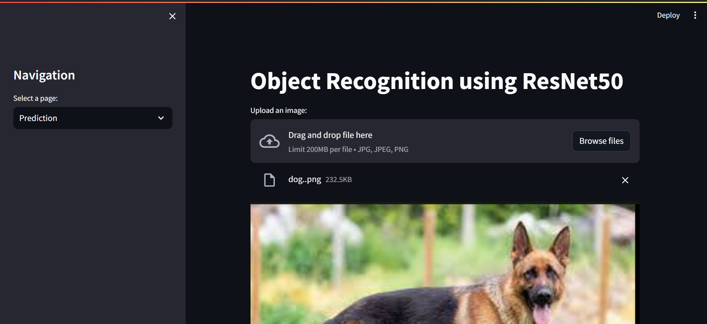
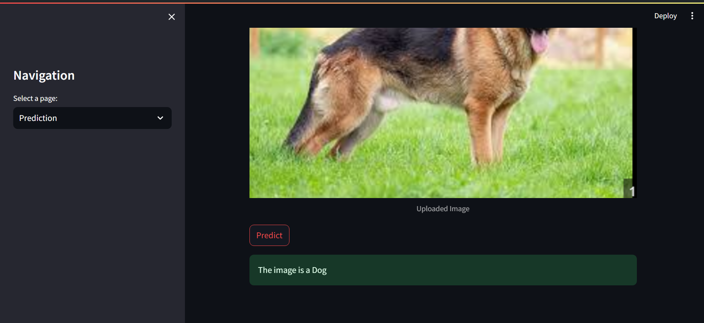
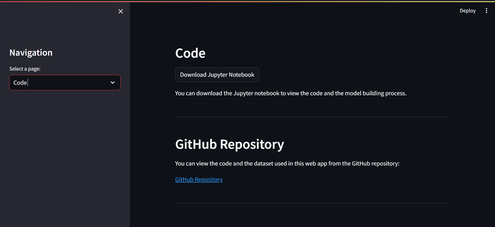
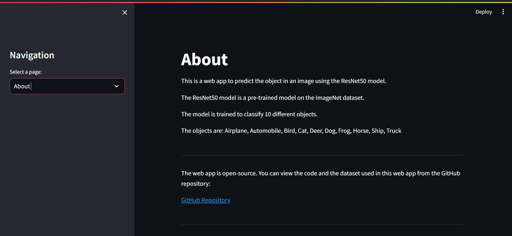

# Object Recognition ResNet50

This is a web app to predict the object in an image using the ResNet50 model. The ResNet50 model is a pre-trained model on the ImageNet dataset. The model is trained to classify 10 different objects.

The objects are: Airplane, Automobile, Bird, Cat, Deer, Dog, Frog, Horse, Ship, Truck

